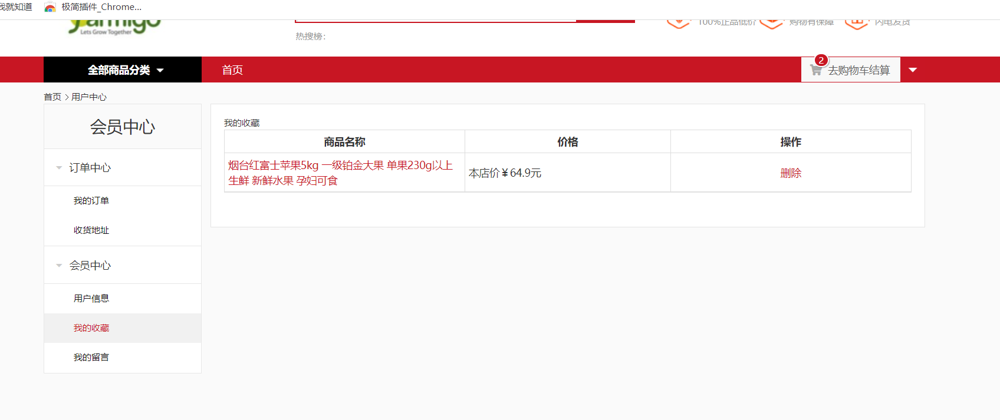

# linko

#### 项目功能介绍
该项目是一个在线商城系统分为前后台

后台管理系统负责的功能有

 1.管理商品 查看商品列表对商品进行增删改以及状态更改 商品详情里有对应分类 品牌，以及基本信息

 2.商品分类 对商品类别的一个管理 分类主要是三级目录  一种类别的商品根据不同的商品品牌为多种商品

 3.品牌分类  同一类别商品分配不同的品牌为不同的商品

 4.订单列表 查看用户下单订单详情以及状态

 5.用户列表 查看用户列表对用户进行增删改 商品详情里可以更改用户的基本信息以及账号密码

 6.用户地址 用户下单后的发货的地址 电话信息 和签收人信息

 7.用户留言 用户的留言信息的查看

 8.轮播图管理 首页的图片的轮播图管理

前台商城

 1.可以搜索商品为模糊查询 也可以根据商品分类查询商品

 2.找到心仪的商品 可以收藏到收藏表 可以对商品加入购物车 也可以直接购买  

 3.购物车的商品可以选择支付 支付后的商品生成订单

 4.在订单中心中 可以查看订单 配置下单后的收货地址

 5.在会员中心 可以更改自己信息 查看收藏的商品

#### 软件架构
##### docker环境

  redis容器  //分布式锁

  rockerMQ容器 //分布式事务

  mysql 容器 //数据的存储

  yapi 容器 //接口的测试

consul容器 //服务的注册和发现

##### go主要环境

grpc  //服务的远程调用 对项目进行分层 模块化

gin  //web层的使用框架

gorm //对数据库的访问 建表 数据的增删改查 


#### 安装启动教程

##### 1.前端

打开前端代码 分别进入mall-master 和online-store 进入终端cnpm run dev

##### 2.后端

将docker环境 对应容器host 和 port 配置到每个服务的global global里有配置说明 

启动:从每个服务的main文件中启动即可 

先启动srv服务 最后启动order服务 以为order需要调用goods服和inventory服务

最后启动全部web服务即可

文件中的data文件有mysql数据和yapi测试接口 

#### 项目难点

##### 1.跨域问题 

问题:项目中用户信息的缓存使用的jwt,登录成功jwt创建x-token返回给客服端 客服端每次访问服务器在header带上x-token是一次非简单请求会造成跨域问题

原因:非简单请求先发送一个空的options请求试探服务器安全性，等服务器详细之后才会发送真正的请求

解决:给gin引擎创建的路由器配置一个中间件cors，cors中先拿到请求的模式并且，配置跨域响应头，将需要的非简单请求模式和响应头都通过c.Header配置 判断获取的模式是否为"options"是就返回成功的响应

##### 2.库存服务商品扣减问题

问题:项目中库存扣减在高并发扣减库存的时候会导致扣减于实际扣减不一致

原因:比如g1,g2,g3在并发下都获取到现在423的商品库存为100，都是扣减1件在更新库存的时候都是执行的100-1，导致本来改扣减3个库存实际只扣减的了个库存

解决:加锁,为了保证性能就没考虑go自带的锁和mysql的悲观锁和乐观锁，使用的是redis的分布式锁

redis的分布式锁可以在获取锁是查看name是否有值 然后获取到锁在进行逻辑处理最后删除key值

##### 3.订单创建消息不一致问题

问题:订单创建需要调用商品服务,库存服务。其中库存服务涉及更新数据表,如果在先商品扣减 然后再执行本地事务。如果扣减成功后面的创建订单失败回滚不会归还已经扣减了的库存

解决:分布式事务。我这里使用的是rocketMQ消息队列保证消息的一致性。

如何保证:本地创建事务生产者发送half消息到rocketMQ,本地再执行本地事务 先扣减库存出错消息就rallback 再在事务中创建订单 订单出错事务rollback 消息commit  消费消息在库存服务如果收到消息就调用归还库存的api保证数据一致性，如果一致没有收到commit 获取rollback消息会调用本地的回查消息保证消息成功发出

##### 4.订单下单不支付归还问题

问题:订单下单后客服一直没有支付如何在分布式事务中合理的传递延时消息

解决:在rockerMQ本地事务中 库存扣减 创建订单没问题后 在commit前发送一个延时消息,本地消费时间到的时候查询订单是否支付没有支付就，发送一个订单归还消息，库存服务消费消息归还库存

##### 5.根据分类级别获取全部商品

问题:如何逻辑清晰的获取全部商品

解决:根据分类级别 如果是级别三就select id from category WHERE id=%d

级别二将where id改为父级别id select id from category WHERE parent_category_id=%d 

级别一就in一下父级别id全部为获取父级别全部为级别一子级别的select id from category where parent_category_id in (select id from category WHERE parent_category_id=%d)

#### 部分服务文件解析

##### 1.库存服务srv层

```
1.表 model
inventory 库存表 负责商品的库存管理
stockseldetail 临时库存表 负责库存归还和库存扣减
2.global 全局变量 DB存储gorm的配置连接数据库 redisClient存储redis的配置连接 常量 相关IP的配置 账号密码的配置 
3.proto 定义好srv的相关服务和配置message“库存信息”，“销售信息”以及api rpc方法 "设置库存" "获取库存信息" “库存扣减” “库存归还”  
4.initialize 入口文件初始化的接口 
db 数据库的连接 logger zap日志的开启 redis redis的连接
5.handler rpc方法的实现 实现proto定义的接口 还有一个消费消息的接口AutoReback
6.main 启动服务
    a： 初始化
    b： 创建grpc服务器 主从handler中的InventoryServer{}实现proto接口的服务到grcp 
    c：net.listen监听服务 
    d：以Goroutine方式启动服务server.Serve(lis)
    e：服务注册到注册中心 注册服务到创建的consul客服端
    f：监听归还库存的topic 创建一个新的PushConsumer实例，并指定NameServer地址和消费者组名 消费order_reback消息归还库存
```

##### 2.订单服务srv层

```
1.表 model
ordergoods 订单商品信息表 负责订单中商品信息
orderinfo 订单信息表 负责订单信息的管理
shoppingcard 购物车表 负责购物车的管理 
2.global 全局变量 DB存储gorm的配置连接数据库 redisClient存储redis的配置连接 常量 相关IP的配置 账号密码的配置 GoodsSrvClient连接商品服务的客服端   InventorySrvClient连接库存服务的客服端
3.proto 定义好srv的相关服务和配置message“库存信息”，“销售信息”以及api rpc方法 "设置库存" "获取库存信息" “库存扣减” “库存归还”  商品服务和库存服务的grpc接口 订单需要远程调用商品服务和库存服务
4.initialize 入口文件初始化的接口 
db 数据库的连接 logger zap日志的开启 srv_coon商品服务和库存服务的连接
5.handler rpc方法的实现 实现proto定义的接口 还有一个消费消息的接口orderTimeout  生产消息时本事务的执行 ExecuteLocalTransaction  以及回查 CheckLocalTransaction
6.main 启动服务
    a： 初始化
    b： 创建grpc服务器 主从handler中的OderServer{}实现proto接口的服务到grcp 
    c：net.listen监听服务 
    d：以Goroutine方式启动服务server.Serve(lis)
    e：服务注册到注册中心 注册服务到创建的consul客服端
    f：监听归还库存的topic 创建一个新的PushConsumer实例，并指定NameServer地址和消费者组名 消费order_timeout消息归还库存

```

##### 3.订单服务web层

```
1.form 
CreateOrderForm 验证创建订单表单格式是否正确
ShopCartItemForm 验证购物车表单格式是否正确
ShopCartItemUpdateForm 验证购物车更新表单格式是否正确
2.global 全局变量 GoodsSrvClient商品服务客服端的连接 OrderSrvClient订单服务客服端的连接 InventorySrvClient 库存服务客服端的连接
常量 相关IP的配置 账号密码的配置 GoodsSrvClient连接商品服务的客服端   InventorySrvClient连接库存服务的客服端
3.proto GoodsSrv  OrderSrv InventorySrv三个grpc服务的接口
4.initialize 入口文件初始化的接口 
logger zap日志的开启 srv_coon商品服务和库存服务和订单服务的连接  router gin配置路由组Router 配置跨域 生成路由组 调用订单路由接口 和 购物车路由接口  vaildator配置验证器的中文信息
5.route 定义订单相关路由和购物车相关路由
6.middlewares 中间件 admin用户权限的中间件 cors跨域中间件 jwt用户身份验证中间件
8.validator 手机号码的验证器
9.models 
request CustomClaims jwt验证器创建token的结构体
10.配置路由中的接口的实现
11.main 启动服务
    a： 初始化
    b：初始化连接服务过程 从注册中心根据服务名获取服务的host 和port 创建一个连接向grpc服务拨号 将拨号的成功连接到客服端
    c： 服务注册到注册中心 注册服务到创建的consul客服端
    d：以Goroutine方式启动路由
 

```

#### 项目部分演示图

##### 后台管理系统


##### 在线商城



